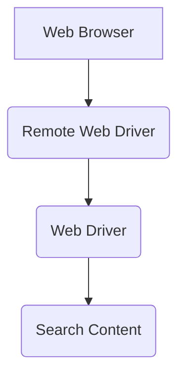

# Complete Selenium e2e Framework

This is the Markdown file in **Complete Selenium e2e Framework**. If you want to learn about Selenium and Cucumber, you can read this file.

## Architecture

Complete Selenium e2e Framework has been developed using Selenium which is traditional and mostly using automation tool which mostly used for Web Based applications along with Cucumber for the BDD implementation. 


## Create files and folders

In the Project source code under the directory of features (src/test/java/features) will be used to store the feature files and under stepDefinitions (src/test/java/stepDefinition) the page objects will be stored in pageObjects (src/test/java/pageObjects) folders.

### Usage

Sample **.feature** file
```gherkin
Feature: As a Pastbook User I should be able to sign up to the application by providing email and I should be able to reset the password

  Background:
    Given I am in Pastbook Home Page

  Scenario Outline: As a user I should be able to Sign up and reset Password
    When I click on sign in menu
    And I navigated to sign in popup screen
    And I click on use email option
    And I enter the <email> to the email text box
    And I click on submit button
    And I get re-directed to Home Page as a Logged in User
    And I navigated to profile
    And I reset the password to <password>
    Then I click on save password button

    Examples:
    |email|password|
    |testpastbook+14@testemail.com|123@com|
```

Sample **Step Definition** File
```java
public class CommonSteps extends BaseClass {
    WebDriver driver;
    HomePageObjects homePageObjects;
    SignInWindowPageObjects windowPageObjects;
    CreatePastBookPageObjects createPastBookPageObjects;
    UploadPicturesPageObjects uploadPicturesPageObjects;
    ProfilePageObjects profilePageObjects;

    @Given("^I am in Pastbook Home Page$")
    public void i_am_in_Pastbook_Home_Page() throws Throwable {
        driver=getDriver();
    }

    @When("^I click on sign in menu$")
    public void i_click_on_sign_in_menu() throws Throwable {
        homePageObjects = new HomePageObjects(driver);

        homePageObjects.getSignInMenu().click();
    }

    @When("^I navigated to sign in popup screen$")
    public void i_navigated_to_sign_in_popup_screen() throws Throwable {
        String parentWindow = driver.getWindowHandle();
        Set<String> tabs = driver.getWindowHandles();

        for (String tab:tabs){
            if (!tab.equals(parentWindow)){
                driver.switchTo().window(tab);
                driver.manage().window().maximize();
            }
        }
    }

    @When("^I click on use email option$")
    public void i_click_on_use_email_option() throws Throwable {
        windowPageObjects = new SignInWindowPageObjects(driver);

        windowPageObjects.getEmailSignIn().click();
    }
}
```
Sample **Page Object** class
```java
public class HomePageObjects {
    WebDriver driver;

    public HomePageObjects(WebDriver driver){
        this.driver=driver;
    }

    By signInMenu = By.id("nav-item-signin");
    By createMenuItem = By.xpath("//*[@id='nav-item-create']/a");

    public WebElement getSignInMenu (){
        return driver.findElement(signInMenu);
    }
    public WebElement getCreateMenuItem(){
        return driver.findElement(createMenuItem);
    }

}
```
### Installation

Complete Selenium e2e Framework needs below tools
[Java Development Kit](https://www.oracle.com/java/technologies/javase/javase-jdk8-downloads.html) v1.8 or v1.7.
[Apache Maven](https://maven.apache.org/download.cgi) v3.6.3 or above.

Execute the test's.

```sh
$ cd complete-selenium-framework
$ mvn test
```

### Plugins

Complete Selenium e2e Framework is currently extended with the following plugins. Instructions on how to use them in your own application are linked below.

| Plugin | Documentation |
| ------ | ------ |
| Selenium | [selenium/documentation][PlDb] |
| Cucumber | [cucumber/documentation][PlGh] |
| JUnit | [JUnit/documentation][PlDh]|

## License
----
All Rights Received by Eranda Kodagoda.

   [PlDh]: <https://junit.org/junit5/docs/current/user-guide/>
   [PlGh]: <https://cucumber.io/docs/gherkin/reference/>
   [PlDb]: <https://www.selenium.dev/documentation/en/>